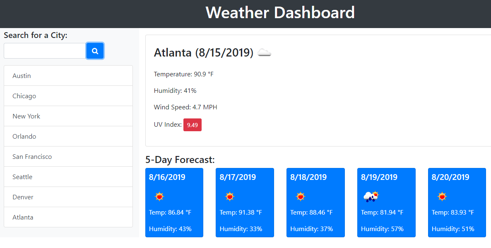

# 06 Server-Side APIs: Weather Dashboard
## University of Arizona Bootcamp  
### Vicky Loebel - Jan 24, 2021  

[vloebel.github.io/server-api](https://vloebel.github.io/server-api/) 

**Modification History**  

* Set up HTML & basic CSS

## Overview
This application uses uses the [OpenWeather API](https://openweathermap.org/api) to retrieve weather data for cities. Search history or other persistant data are stored in the browser's `localStorage`.

## Requirements
* City search returns current and future weather conditions for the city and adds city to search history
* Displayed weather conditions include the city name, date, an icon representation of weather conditions,  temperature,  humidity,  wind speed, and the UV index  

  * UV index includes a color that indicates whether the conditions are favorable, moderate, or severe
  * Future weather conditions include a 5-day forecast that displays the date, an icon representation of weather conditions, the temperature, and the humidity
  * Selecting a city from the search history starts over with the display for that city.

## Mockup

The following animation demonstrates the application functionality:

